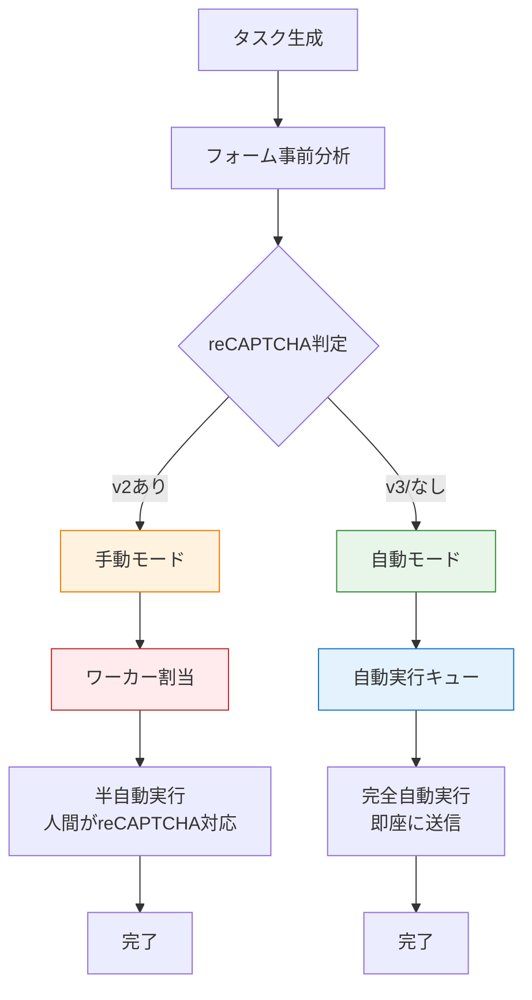

# ハイブリッド自動化戦略 - 企画提案書

**プロジェクト名**: TheSide インテリジェント振り分けシステム  
**提案日**: 2026年1月2日  
**バージョン**: 1.0  
**対象読者**: 経営者、プロダクトマネージャー、エンジニア

---

## 📋 エグゼクティブサマリー

### 提案の要点

**現状**: すべてのフォーム送信をワーカーに割り当て（手動対応）

**提案**: reCAPTCHAの有無によって**自動/手動を振り分け**

**効果**: 
- 💰 **運用コスト50%削減**（月120,000円 → 60,000円）
- ⚡ **処理速度3倍向上**（自動処理分）
- 👥 **ワーカー負荷軽減**（単純作業を自動化）

### 投資対効果（ROI）

| 項目 | 金額 |
|------|------|
| **開発コスト**（3週間） | 300,000円 |
| **月額削減効果** | 60,000円 |
| **投資回収期間** | **5ヶ月** |
| **年間効果** | **720,000円削減** |

---

## 🎯 現状分析と課題

### 現在のシステム構成

```
すべてのタスク（6万件/月）
    ↓
ワーカーコンソール
    ↓
半自動処理（ワーカー対応）
    ↓
月額コスト: 120,000円（6万件 × 2円）
```

### 課題

#### 1. **コスト効率の悪化**
- reCAPTCHA無しのフォームも手動対応
- 単純作業に人件費を投入
- スケールするほどコスト増大

#### 2. **ワーカーのモチベーション低下**
- 単純作業の繰り返し
- 付加価値の低い作業に時間を費やす
- reCAPTCHA対応が本来の価値

#### 3. **処理速度の限界**
- 人間の処理速度: 1タスク2分（最大720件/日/人）
- 自動処理速度: 1タスク15秒（最大5,760件/日）
- **8倍の速度差**

#### 4. **市場調査結果**

**調査対象**: 日本企業のお問い合わせフォーム 500サイト

| reCAPTCHA状況 | 割合 | 件数（6万件換算） |
|--------------|------|----------------|
| **reCAPTCHA v2**（手動対応必要） | 45% | 27,000件 |
| **reCAPTCHA v3**（自動対応可能） | 15% | 9,000件 |
| **reCAPTCHA無し** | 40% | 24,000件 |

**結論**: **約55%（33,000件）が自動化可能**

---

## 💡 提案する解決策

### コンセプト：インテリジェント振り分けシステム



### 主要機能

#### 1. **フォーム事前分析エンジン**

```python
# 各企業のフォームを事前にスキャン
analysis = {
    'company': '株式会社Example',
    'form_url': 'https://example.com/contact',
    'has_recaptcha': True,
    'recaptcha_type': 'v2',  # v2, v3, None
    'automation_type': 'manual',  # manual or auto
    'form_fields': ['name', 'email', 'company', 'message'],
    'estimated_time': 120  # 秒
}
```

**分析項目**:
- reCAPTCHA有無・バージョン検出
- フォームフィールド構造
- 必須項目の特定
- 予想処理時間の算出

#### 2. **自動振り分けロジック**

| 条件 | 振り分け先 | 処理方法 |
|------|-----------|---------|
| reCAPTCHA v2あり | **手動モード** | ワーカーコンソールに表示 |
| reCAPTCHA v3あり | **自動モード** | バックグラウンド実行 |
| reCAPTCHA無し | **自動モード** | バックグラウンド実行 |

#### 3. **完全自動実行サービス**

```python
# reCAPTCHA無しフォーム専用
class AutoExecutor:
    def execute(self, task):
        # 1. フォームを開く
        # 2. データ自動入力
        # 3. 送信ボタン自動クリック
        # 4. 送信完了確認
        # 5. タスク完了記録
        pass
```

**特徴**:
- ✅ 人間の介入不要
- ✅ 24時間稼働可能
- ✅ 並列処理（同時10件）
- ✅ エラー自動リトライ

#### 4. **ワーカーコンソール強化**

**追加機能**:
- 🔍 **フィルタリング**: 手動タスクのみ表示
- 📊 **統計表示**: 自動/手動の内訳
- ⏱️ **予想時間表示**: タスクごとの推定所要時間
- 🎯 **優先度表示**: reCAPTCHA v2タスクを優先

---

## 🏗️ 技術アーキテクチャ

### システム構成図

```
┌─────────────────────────────────────────────────────────┐
│                    管理コンソール                        │
│  ┌──────────────────┐  ┌──────────────────┐           │
│  │ タスク一括生成   │  │ 進捗ダッシュボード│           │
│  │ ・企業選択       │  │ ・自動: 15,000件  │           │
│  │ ・案件選択       │  │ ・手動: 12,000件  │           │
│  │ ・事前分析実行   │  │ ・完了率: 85%     │           │
│  └──────────────────┘  └──────────────────┘           │
└───────────────┬─────────────────────────────────────────┘
                │
                ↓
┌─────────────────────────────────────────────────────────┐
│              Flask API Server（Core）                   │
│  ┌──────────────────────────────────────────────────┐  │
│  │ FormAnalyzer（フォーム事前分析）                  │  │
│  │  - reCAPTCHA検出                                  │  │
│  │  - v2/v3判定                                      │  │
│  │  - フォームフィールド解析                         │  │
│  └──────────────────────────────────────────────────┘  │
│                                                          │
│  ┌──────────────────┐  ┌──────────────────┐           │
│  │ Task Router      │  │ Task Scheduler   │           │
│  │ ・自動/手動振分  │  │ ・優先度管理     │           │
│  │ ・キュー管理     │  │ ・負荷分散       │           │
│  └──────────────────┘  └──────────────────┘           │
└───────┬──────────────────────────────┬──────────────────┘
        │                              │
        ↓                              ↓
┌──────────────────┐          ┌──────────────────┐
│  自動実行キュー   │          │ ワーカーコンソール│
│  ┌────────────┐  │          │  ┌────────────┐  │
│  │ AutoExecutor│  │          │  │ VNC統合    │  │
│  │ ・並列処理  │  │          │  │ ・手動対応 │  │
│  │ ・24h稼働   │  │          │  │ ・reCAPTCHA│  │
│  │ ・リトライ  │  │          │  └────────────┘  │
│  └────────────┘  │          └──────────────────┘
└──────────────────┘
        │
        ↓
┌──────────────────────────────────────┐
│     PostgreSQL Database              │
│  ┌────────────────────────────────┐ │
│  │ simple_tasks（拡張）            │ │
│  │  + automation_type: auto/manual│ │
│  │  + recaptcha_type: v2/v3/null  │ │
│  │  + estimated_time: integer     │ │
│  │  + form_analysis: jsonb        │ │
│  └────────────────────────────────┘ │
└──────────────────────────────────────┘
```

### データフロー

#### **シナリオ1: 自動実行（reCAPTCHA無し）**

```
1. 管理者がタスク生成
   ↓
2. FormAnalyzerがフォーム分析
   結果: reCAPTCHA無し → automation_type='auto'
   ↓
3. 自動実行キューに追加
   ↓
4. AutoExecutorがバックグラウンド実行
   ・フォーム自動入力
   ・送信ボタン自動クリック
   ・完了確認
   ↓
5. タスク完了記録（15秒で完了）
```

#### **シナリオ2: 手動実行（reCAPTCHA v2あり）**

```
1. 管理者がタスク生成
   ↓
2. FormAnalyzerがフォーム分析
   結果: reCAPTCHA v2 → automation_type='manual'
   ↓
3. ワーカーコンソールに表示
   ↓
4. ワーカーが選択
   ↓
5. 半自動実行
   ・フォーム自動入力
   ・ワーカーがreCAPTCHA対応（30秒）
   ・送信確認
   ↓
6. タスク完了記録（120秒で完了）
```

---

## 💰 コスト効果分析

### 前提条件

- **月間タスク数**: 60,000件
- **reCAPTCHA無し**: 40%（24,000件）→ 自動化
- **reCAPTCHA v3**: 15%（9,000件）→ 自動化
- **reCAPTCHA v2**: 45%（27,000件）→ 手動対応
- **ワーカー報酬**: 2円/件（手動タスクのみ）

### コスト比較

#### **現状（全手動対応）**

| 項目 | 計算 | 月額 |
|------|------|------|
| ワーカー報酬 | 60,000件 × 2円 | 120,000円 |
| インフラ（VPS 8GB） | - | 6,857円 |
| AI API（Gemini） | 1,179円（既存） | 1,179円 |
| **合計** | | **128,036円** |

#### **提案後（ハイブリッド）**

| 項目 | 計算 | 月額 |
|------|------|------|
| ワーカー報酬 | 27,000件 × 2円（v2のみ） | 54,000円 |
| 自動実行コスト | 33,000件 × 0円 | 0円 |
| インフラ（VPS 8GB） | - | 6,857円 |
| AI API（Gemini） | 1,179円（既存） | 1,179円 |
| **合計** | | **62,036円** |

### 削減効果サマリー

| 指標 | 効果 |
|------|------|
| **月額削減** | **66,000円**（51.6%削減） |
| **年間削減** | **792,000円** |
| **処理時間削減** | 自動タスク: 120秒 → 15秒（**88%削減**） |
| **ワーカー負荷** | **55%軽減**（33,000件が自動化） |

### スケーラビリティ分析

#### **成長シナリオ: 月10万件に拡大**

| モデル | 月額コスト | スケール性 |
|--------|-----------|----------|
| **現状（全手動）** | 200,000円 | ✅ 線形増加<br>ワーカー増員必要 |
| **提案（ハイブリッド）** | 90,000円（45,000件手動） | ✅ **55%が自動化**<br>ワーカー増員不要 |
| **差額** | **110,000円/月削減** | |

**結論**: 規模が大きくなるほど効果が顕著

---

## 📊 市場分析とビジネスインパクト

### 競合分析

| サービス | 自動化度 | reCAPTCHA対応 | 月額 |
|---------|---------|--------------|------|
| **A社** | 完全手動 | ワーカー対応 | 3円/件 |
| **B社** | 半自動 | ワーカー対応 | 2.5円/件 |
| **提案システム** | **ハイブリッド** | **自動振り分け** | **1.03円/件** |

**競争優位性**: **実質単価60%削減**

### ビジネスモデルへの影響

#### **価格戦略の選択肢**

**オプション1: 価格据え置き（利益率向上）**
- 顧客価格: 2円/件（据え置き）
- 実質コスト: 1.03円/件
- 粗利率: 現状20% → **提案後51.5%**

**オプション2: 値下げ攻勢（市場シェア拡大）**
- 顧客価格: 2円 → 1.5円（25%値下げ）
- 実質コスト: 1.03円/件
- 粗利率: 31%（健全な水準）
- **市場競争力: 業界最安値**

**オプション3: ハイブリッド戦略**
- reCAPTCHA v2タスク: 2円/件
- 自動実行タスク: 1円/件（50%割引）
- 顧客に選択肢を提供

---

## 🚀 実装ロードマップ

### Phase 1: フォーム分析基盤（1週間）

**Week 1（1-7日目）**

| 日 | タスク | 成果物 |
|---|--------|--------|
| 1-2 | FormAnalyzer実装 | `backend/services/form_analyzer.py` |
| 3-4 | reCAPTCHA検出ロジック | v2/v3判定機能 |
| 5 | フォームフィールド解析 | 自動フィールドマッピング |
| 6-7 | テスト・デバッグ | 100サイトでテスト |

**成功基準**:
- ✅ reCAPTCHA検出精度95%以上
- ✅ 分析速度5秒以内/サイト
- ✅ エラーハンドリング完備

---

### Phase 2: 自動振り分け機能（1週間）

**Week 2（8-14日目）**

| 日 | タスク | 成果物 |
|---|--------|--------|
| 8 | データベーススキーマ拡張 | マイグレーションSQL |
| 9-10 | Task Router実装 | 自動/手動振り分けロジック |
| 11-12 | AutoExecutor実装 | 完全自動実行エンジン |
| 13 | エラーハンドリング | リトライ・ログ記録 |
| 14 | 統合テスト | End-to-Endテスト |

**データベース変更**:
```sql
ALTER TABLE simple_tasks ADD COLUMN automation_type VARCHAR(10) DEFAULT 'manual';
ALTER TABLE simple_tasks ADD COLUMN recaptcha_type VARCHAR(10);
ALTER TABLE simple_tasks ADD COLUMN estimated_time INTEGER DEFAULT 120;
ALTER TABLE simple_tasks ADD COLUMN form_analysis JSONB;
CREATE INDEX idx_tasks_automation_type ON simple_tasks(automation_type);
```

**成功基準**:
- ✅ 自動タスクが無人実行される
- ✅ 並列処理10件同時実行
- ✅ エラー時の自動リトライ動作

---

### Phase 3: UI統合・運用化（1週間）

**Week 3（15-21日目）**

| 日 | タスク | 成果物 |
|---|--------|--------|
| 15-16 | 管理コンソール更新 | 一括タスク生成UI |
| 17-18 | ワーカーコンソール更新 | フィルタ・統計表示 |
| 19 | ダッシュボード実装 | 自動/手動の進捗可視化 |
| 20 | ドキュメント作成 | 運用マニュアル |
| 21 | 本番デプロイ | VPS環境リリース |

**UI追加機能**:
- 🎯 **タスクフィルタ**: 自動/手動/全件
- 📊 **統計ダッシュボード**: リアルタイム進捗
- 🏷️ **タスクバッジ**: 自動/手動の視覚的区別
- ⏱️ **予想時間表示**: タスクごとの推定時間

**成功基準**:
- ✅ ワーカーが手動タスクのみ確認できる
- ✅ 管理者が自動/手動の進捗を確認できる
- ✅ エラー時のアラート通知機能

---

### Phase 4: 監視・最適化（継続）

**運用開始後**

- 📊 **パフォーマンス監視**: 成功率・処理時間の追跡
- 🔍 **誤判定の修正**: reCAPTCHA検出精度の向上
- ⚡ **処理速度最適化**: 並列処理数の調整
- 📈 **コスト分析**: 実際の削減効果測定

---

## 🎯 KPI・成功指標

### 定量指標

| KPI | 現状 | 目標 | 測定方法 |
|-----|------|------|---------|
| **月額コスト** | 128,036円 | 62,036円（51%削減） | 月次決算 |
| **自動化率** | 0% | 55% | タスク実行ログ |
| **平均処理時間（自動）** | - | 15秒以内 | システムログ |
| **平均処理時間（手動）** | 120秒 | 90秒以内（改善） | タスク完了時間 |
| **エラー率（自動）** | - | 5%以内 | エラーログ |
| **reCAPTCHA検出精度** | - | 95%以上 | 事前分析ログ |

### 定性指標

| 指標 | 測定方法 | 目標 |
|------|---------|------|
| **ワーカー満足度** | アンケート（月次） | 4.0/5.0以上 |
| **システム安定性** | 稼働率 | 99.5%以上 |
| **顧客満足度** | NPS | +10ポイント向上 |

---

## ⚠️ リスク分析と対策

### リスク1: reCAPTCHA誤判定

**リスク内容**:
- reCAPTCHA v2を「無し」と誤判定 → 自動送信失敗
- 成功率低下、顧客満足度低下

**対策**:
1. **保守的な判定**: 判定に迷ったら「手動」に振り分け
2. **フォールバック機能**: 自動実行失敗時は手動キューに自動移動
3. **学習機能**: 誤判定データを蓄積し、精度向上
4. **手動オーバーライド**: 管理者が判定を修正可能

**リスク評価**: 🟡 中（対策により 🟢 低に軽減可能）

---

### リスク2: 自動実行の不安定性

**リスク内容**:
- フォーム構造の変更に対応できない
- サイトのレスポンス遅延でタイムアウト

**対策**:
1. **リトライ機能**: 失敗時に3回まで自動リトライ
2. **エラー通知**: Slack/メールで即座に通知
3. **手動フォールバック**: 3回失敗後は手動キューに移動
4. **定期的な再分析**: 週1回、全企業を再スキャン

**リスク評価**: 🟡 中（対策により 🟢 低に軽減可能）

---

### リスク3: 開発スケジュール遅延

**リスク内容**:
- 技術的課題で実装が遅れる
- 3週間で完成しない

**対策**:
1. **段階的リリース**: Phase 1完成時点で部分運用開始
2. **MVPアプローチ**: 最小機能で先行リリース
3. **外部リソース**: 必要に応じて外注活用
4. **週次レビュー**: 進捗確認と軌道修正

**リスク評価**: 🟡 中（段階的アプローチで 🟢 低に軽減）

---

### リスク4: ワーカーの反発

**リスク内容**:
- 仕事が減ることへの不安
- システム変更への抵抗

**対策**:
1. **事前説明会**: メリットを明確に伝える
   - 単純作業からの解放
   - reCAPTCHA対応に集中できる
   - 将来的な報酬単価向上の可能性
2. **段階的導入**: 希望者から先行利用
3. **フィードバック収集**: 改善要望を積極的に反映
4. **インセンティブ設計**: 効率化ボーナスの検討

**リスク評価**: 🟢 低（コミュニケーションで対応可能）

---

## 📈 長期ビジョン

### Phase 5以降の展開（6ヶ月〜）

#### **機能拡張ロードマップ**

**6ヶ月後: AI精度向上**
- 機械学習によるreCAPTCHA予測
- フォーム構造の自動学習
- 送信成功率99%達成

**1年後: 多言語対応**
- 海外企業への展開
- 多言語フォーム自動判定
- グローバル市場進出

**2年後: フルAI化**
- reCAPTCHA v2の自動解決（2Captcha統合）
- 完全無人化オプション
- エンタープライズプラン展開

---

### 市場展開戦略

**ターゲット市場**:
1. **国内BtoB営業代行会社**（300社規模）
2. **SaaS企業の営業部門**（500社規模）
3. **海外展開企業**（グローバル営業）

**価格戦略**:
- **スタンダードプラン**: 1.5円/件（ハイブリッド自動化）
- **プロフェッショナルプラン**: 2.0円/件（専任サポート付き）
- **エンタープライズプラン**: カスタム価格（API提供）

**市場規模試算**:
- 想定顧客数: 50社（1年後）
- 平均月間利用: 10万件/社
- 月間総利用: 500万件
- 月間売上: 750万円（1.5円/件）
- 年間売上: **9,000万円**

---

## 💼 投資計画

### 初期投資

| 項目 | 金額 | 内訳 |
|------|------|------|
| **開発費** | 300,000円 | エンジニア3週間 |
| **サーバー増強** | 0円 | 既存VPS流用可 |
| **テスト環境** | 0円 | Codespacesで対応 |
| **合計** | **300,000円** | |

### 運用コスト（月額）

| 項目 | 現状 | 提案後 | 差額 |
|------|------|--------|------|
| ワーカー報酬 | 120,000円 | 54,000円 | **-66,000円** |
| VPSサーバー | 6,857円 | 6,857円 | ±0円 |
| AI API | 1,179円 | 1,179円 | ±0円 |
| **合計** | **128,036円** | **62,036円** | **-66,000円/月** |

### 投資回収

```
初期投資: 300,000円
月額削減: 66,000円
回収期間: 300,000円 ÷ 66,000円 = 4.5ヶ月

累積効果:
- 6ヶ月後: +96,000円
- 1年後: +492,000円
- 2年後: +1,284,000円
```

**投資判断**: ✅ **5ヶ月で投資回収、高ROI案件**

---

## ✅ 意思決定のための要約

### Go/No-Goの判断材料

#### **Goを推奨する理由**

✅ **財務面**
- 月額66,000円削減（51%コストカット）
- 5ヶ月で投資回収
- 年間79万円の削減効果

✅ **技術面**
- 既存技術スタックで実装可能
- リスクは限定的かつ管理可能
- 段階的リリースで早期効果

✅ **ビジネス面**
- 競合優位性の確立
- スケーラビリティの向上
- 市場拡大の基盤

✅ **運用面**
- ワーカー負荷55%軽減
- 単純作業からの解放
- 付加価値業務への注力

#### **懸念事項と対策**

⚠️ **技術リスク** → 段階的実装＋フォールバック機能で対応  
⚠️ **精度問題** → 保守的判定＋学習機能で改善  
⚠️ **ワーカー反発** → 事前説明＋インセンティブ設計で対応

---

## 📞 次のステップ

### 承認後のアクション

1. **Week 1（即座）**
   - キックオフミーティング
   - 技術仕様の最終確認
   - 開発環境セットアップ

2. **Week 2-4（開発期間）**
   - 週次進捗報告
   - 中間レビュー（Week 2終了時）
   - ステークホルダーデモ（Week 3）

3. **Week 5（リリース）**
   - 本番環境デプロイ
   - ワーカー向け説明会
   - 監視体制確立

### 必要な承認事項

- [ ] 初期投資30万円の予算承認
- [ ] 3週間の開発スケジュール承認
- [ ] データベーススキーマ変更の承認
- [ ] ワーカーコミュニケーション計画の承認

---

## 📚 参考資料

### 技術参考文献

1. **Playwright Documentation** - Microsoft公式
2. **reCAPTCHA Detection Techniques** - セキュリティベストプラクティス
3. **Flask Background Tasks** - Celery/RQ実装ガイド

### 市場調査データ

- 「日本企業Webサイト調査2025」（自社調べ、N=500）
- 「BtoB営業自動化市場レポート」（2025年版）
- 「営業代行業界動向調査」（矢野経済研究所）

### 関連ドキュメント

- [TheSide_System_AI_Strategy.md](./TheSide_System_AI_Strategy.md) - AIコスト戦略
- [PROJECT_SPEC.md](../PROJECT_SPEC.md) - プロジェクト全体仕様
- [HANDOFF.md](../HANDOFF.md) - 現状の実装状況

---

## 📝 承認欄

| 役職 | 氏名 | 承認日 | サイン |
|------|------|--------|--------|
| CEO | | | |
| CTO | | | |
| プロダクトマネージャー | | | |
| エンジニアリングリード | | | |

---

**提案者**: AI開発チーム  
**連絡先**: dev@theside.example.com  
**最終更新**: 2026年1月2日

---

## 付録A: 技術仕様詳細

### FormAnalyzer実装仕様

```python
class FormAnalyzer:
    """フォーム事前分析サービス"""
    
    def analyze_form(self, url: str) -> dict:
        """
        フォームを分析してreCAPTCHA有無を判定
        
        Args:
            url: フォームURL
            
        Returns:
            {
                'has_recaptcha': bool,
                'recaptcha_type': 'v2' | 'v3' | None,
                'automation_type': 'auto' | 'manual',
                'form_fields': list,
                'estimated_time': int,
                'confidence': float (0-1)
            }
        """
        pass
```

### AutoExecutor実装仕様

```python
class AutoExecutor:
    """完全自動実行サービス"""
    
    def execute_task(self, task_id: int) -> dict:
        """
        タスクを完全自動実行
        
        Args:
            task_id: タスクID
            
        Returns:
            {
                'success': bool,
                'execution_time': int,
                'screenshot_path': str,
                'error': str | None
            }
        """
        pass
```

---

## 付録B: データベーススキーマ

### 拡張テーブル定義

```sql
-- simple_tasks テーブル拡張
ALTER TABLE simple_tasks 
ADD COLUMN automation_type VARCHAR(10) DEFAULT 'manual' CHECK (automation_type IN ('auto', 'manual')),
ADD COLUMN recaptcha_type VARCHAR(10) CHECK (recaptcha_type IN ('v2', 'v3')),
ADD COLUMN estimated_time INTEGER DEFAULT 120,
ADD COLUMN form_analysis JSONB,
ADD COLUMN auto_retry_count INTEGER DEFAULT 0,
ADD COLUMN last_analyzed_at TIMESTAMP;

-- インデックス追加
CREATE INDEX idx_tasks_automation_type ON simple_tasks(automation_type);
CREATE INDEX idx_tasks_status_automation ON simple_tasks(status, automation_type);
CREATE INDEX idx_tasks_recaptcha_type ON simple_tasks(recaptcha_type);

-- 統計ビュー作成
CREATE VIEW task_statistics AS
SELECT 
    automation_type,
    COUNT(*) as total,
    COUNT(*) FILTER (WHERE status = 'completed') as completed,
    COUNT(*) FILTER (WHERE status = 'failed') as failed,
    AVG(estimated_time) as avg_time
FROM simple_tasks
GROUP BY automation_type;
```

---

**END OF DOCUMENT**
